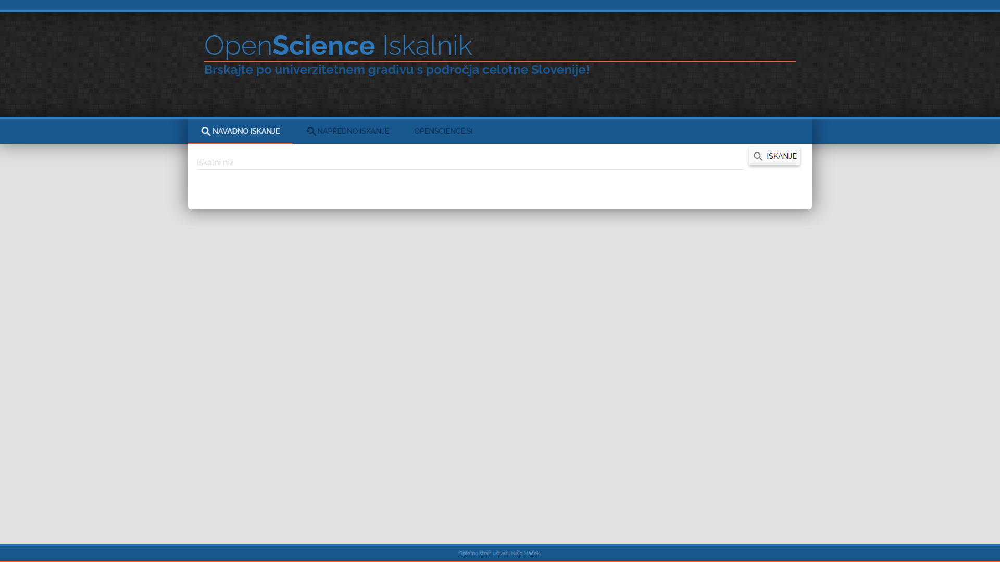

# OpenScience Alt

This project was made at University of Maribor. It features a frontend part of an advanced search engine and own design, built with AngularJS and Angular Material back in academic year 2015/2016.

An online version is available [here](https://openscience.si/iskanjeNejcMacek/), although the backend API has changed so the app no longer works.
